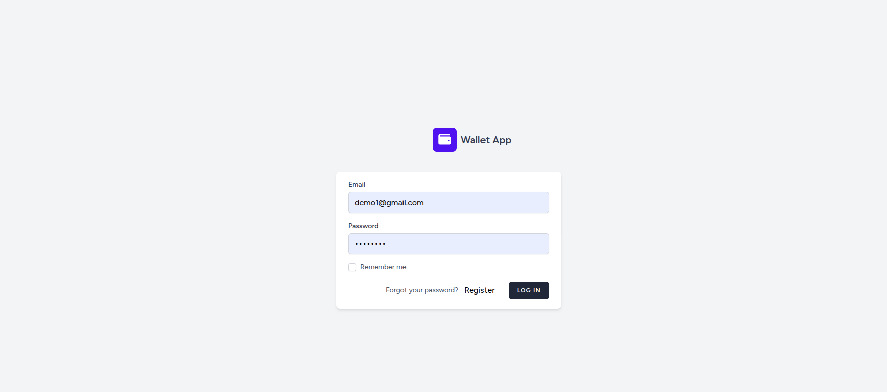
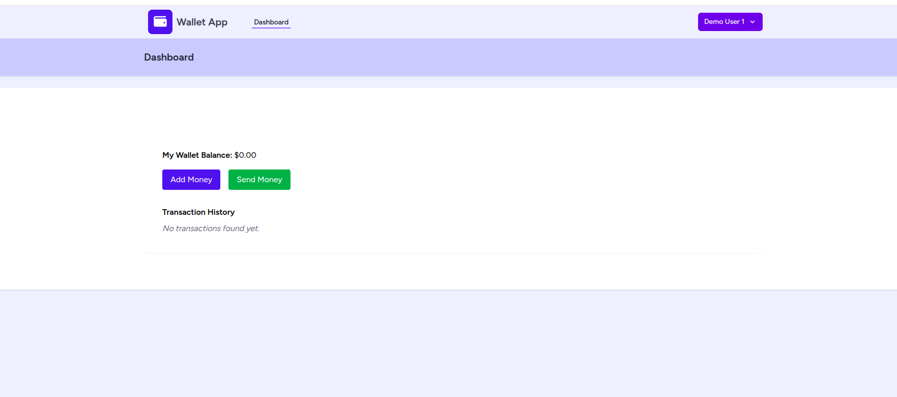
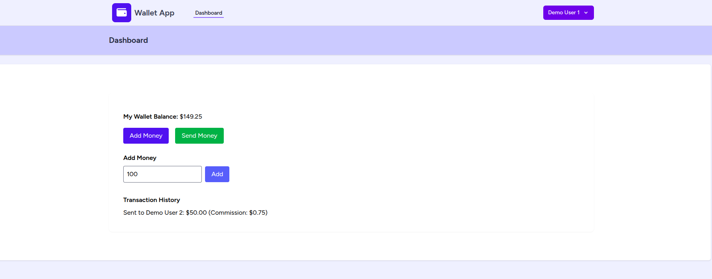
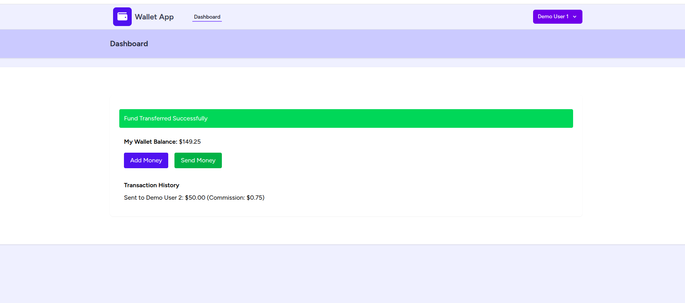
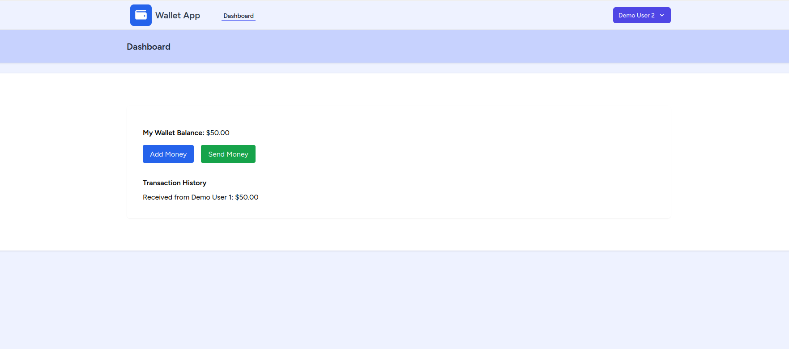

Laravel Wallet App

A secure and real-time digital wallet built with Laravel, Vue.js, Pusher, and Laravel Sanctum.
This application allows users to manage funds, transfer money, view transaction history, and receive instant real-time updates whenever money is sent or received.

📦 Installation


1️⃣ Clone the Repository
```
git clone https://github.com/pramod-alpy/wallet.git
cd wallet

```

2️⃣ Install PHP Dependencies
```
composer install
```
3️⃣ Install JS Dependencies
```
npm install
```
4️⃣ Copy .env File
```
cp .env.example .env
```
5️⃣ Generate App Key
```
php artisan key:generate
```
6️⃣ Configure Database in .env
```
DB_CONNECTION=mysql
DB_HOST=localhost
DB_PORT=3306
DB_DATABASE=wallet_db
DB_USERNAME=root
DB_PASSWORD=
```
7️⃣ Setup Pusher 
```
PUSHER_APP_ID=2078432
PUSHER_APP_KEY=5fa2c0af5c6f5f0aeb40
PUSHER_APP_SECRET=289be947a5903bf8270e
PUSHER_APP_CLUSTER=ap2
PUSHER_APP_USETLS=true
VITE_PUSHER_APP_KEY=5fa2c0af5c6f5f0aeb40
VITE_PUSHER_APP_CLUSTER=ap2
```
8️⃣ Run Migrations
```
php artisan migrate
```
9️⃣ Run Seeders
```
php artisan db:seed
```
🔟 Start Backend Server
```
php artisan serve
```
1️⃣1️⃣ Start Frontend Server
```
npm run dev
```

👤 Demo Login Credentials
```
* Email: demo1@gmail.com / demo2@gmail.com

* Password: password

```
💸 How to Use

Add Money

* Click the Add Money button

* Enter an amount (e.g., 100)

* Click Add

Send Money

* Click the Send Money button

* Enter the Receiver ID (e.g., Enter 2 - (Demo User 2 Receiver ID=2))

* Enter the Amount (e.g., 10)

* Click Send

The amount will be debited from your account and displayed in the Transaction History

⚙️ Tech Stack

* Backend: Laravel, MySQL, Laravel Sanctum

* Frontend: Vue.js, Tailwind CSS

* Other: Composer, npm

✨ Screenshots

User Authentication:


Demo User 1 - Dashboard:


Add Funds:


Send Money:


Demo User 2 - Dashboard With Transaction History
